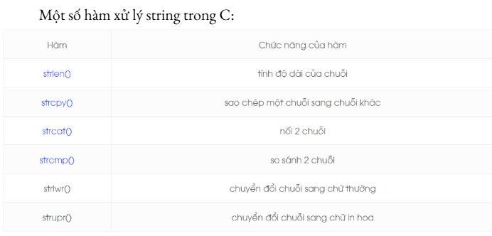
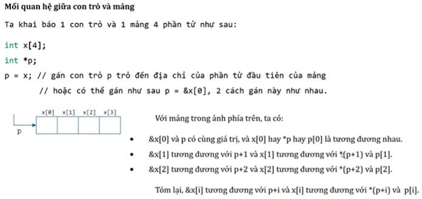

# 💡 Hướng dẫn về Con trỏ cấp 2 trong C

Tài liệu này cung cấp kiến thức cơ bản, ví dụ thực tế và giải thích rõ ràng về **con trỏ cấp 2 (double pointer)** trong lập trình C.

---

## 📚 Mục lục

- [Tổng quan](#tổng-quan)
- [Con trỏ cấp 2 là gì?](#con-trỏ-cấp-2-là-gì)
- [Cách khai báo và sử dụng](#cách-khai-báo-và-sử-dụng)
- [Ví dụ cơ bản](#ví-dụ-cơ-bản)
- [Ứng dụng của con trỏ cấp 2](#ứng-dụng-của-con-trỏ-cấp-2)
- [Lưu ý khi sử dụng](#lưu-ý-khi-sử-dụng)
- [Tài liệu tham khảo](#tài-liệu-tham-khảo)

---

## 🧠 Tổng quan

Con trỏ cấp 2 là **con trỏ trỏ đến một con trỏ khác**. Nó giúp chúng ta thao tác sâu hơn với bộ nhớ, thay đổi địa chỉ con trỏ trong hàm, quản lý mảng 2 chiều, và nhiều tình huống nâng cao khác trong lập trình C.

---

## 🏷️ Con trỏ cấp 2 là gì?

- Con trỏ cấp 2 là một biến lưu **địa chỉ của một con trỏ khác**.
- Ký hiệu: `**`, ví dụ: `int **pptr;`
- Có thể được hiểu như:  
  `**pptr` → giá trị của biến gốc  
  `*pptr` → con trỏ cấp 1  
  `pptr` → con trỏ cấp 2

---

## ⚙️ Cách khai báo và sử dụng

### Khai báo:

```c
int a = 5;
int *p = &a;       // con trỏ cấp 1
int **pp = &p;     // con trỏ cấp 2
```
## 🔍 Ví dụ cơ bản



Con trỏ cấp 1 lưu trữ địa chỉ của một biến còn con trỏ cấp 2 lưu trữ địa chỉ của 1 con trỏ.
